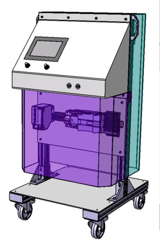
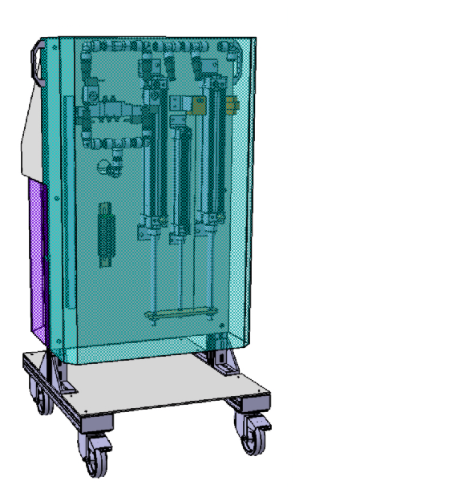

# AirGyver

**Ventilador médico de emergencia para soporte respiratorio basado en componentes industriales de alta disponibilidad**  
Proyecto desarrollado en abril de 2020 como iniciativa *open source* ante la emergencia sanitaria del COVID-19.

https://proyectoairgyver.com/

  
  

---

## 🧩 Descripción

AirGyver es un **prototipo funcional de ventilador médico invasivo**, diseñado con componentes industriales estándar (neumática, PLC Siemens, sensores de presión y posición, etc.) para facilitar su fabricación local en situaciones de crisis.

El proyecto fue concebido para ofrecer una solución rápida, robusta y reproducible en caso de escasez de ventiladores comerciales, utilizando exclusivamente componentes de fácil adquisición en el sector industrial.

> ⚠️ **AirGyver no dispone de certificación médica ni aprobación regulatoria**.  
> Sin embargo, **sí fue objeto de ensayos clínicos experimentales** realizados en 2020 bajo supervisión del **Grupo de Investigación en Técnicas Mínimamente Invasivas (GITMI)** de la **Universidad de Zaragoza**, conforme a las normas del **RD 1201/2005** sobre experimentación animal.

---

## 🧪 Ensayo y validación

Según el informe oficial incluido en [`/docs/Informe_GITMI_Valoracion_Prototipo_Porcino.pdf`](./docs/Informe_GITMI_Valoracion_Prototipo_Porcino.pdf):

- 📍 **Lugar:** Facultad de Veterinaria – Hospital Veterinario Universidad de Zaragoza  
- 🗓️ **Fecha:** 3 de abril de 2020  
- 🧬 **Modelo experimental:** animal porcino anestesiado (Sus scrofa domesticus, 86 kg)  
- 🧑‍🔬 **Equipo investigador:** Dr. Miguel Á. de Gregorio, Dra. Carolina Serrano, Dra. Cristina Bonastre, entre otros  
- 🩺 **Resultados:**  
  - Saturación de O₂ (SaO₂) mantenida > 95 %  
  - Presión arterial media > 60 mm Hg  
  - Capnografía estable sin reinhalación de CO₂  
  - Gasometrías arteriales dentro de rango fisiológico  
- ✅ **Conclusión:** comportamiento ventilatorio satisfactorio en condiciones clínicas controladas, demostrando viabilidad funcional del prototipo.

---

## 🧠 Documentación técnica

Toda la documentación se encuentra en la carpeta [`/docs`](./docs):

- **Especificaciones Técnicas** → descripción del diseño, PLC, HMI y sensores  
- **Manual de Usuario** → puesta en marcha, configuración y alarmas  
- **Procedimiento de Limpieza** → protocolo de desinfección y esterilización  
- **Informe GITMI** → validación experimental y resultados del ensayo clínico

Los esquemas eléctricos y neumáticos están disponibles en [`/planos`](./planos).

---

## 🧰 Componentes principales

- PLC Siemens S7-1200 + HMI táctil Profinet  
- Cilindros neumáticos ISO 15552 (Ø 50 × 300 mm)  
- Sensor de presión BOSCH 0 261 230 132  
- Sensor láser de posición IFM O1D100  
- Electroválvulas Camozzi 1/4" y 1/8"  
- SAI 750 VA  

---

## 👥 Autores

Proyecto desarrollado de forma altruista por:

- Abel Roca Andreu  
- Alejandro Gazulla Sancho  
- Alberto López Germán  
- Gabriel Aznar Lapuente  
- Javier González Vidorreta  
- Jorge Olite Biurrun  

---

## 🧾 Licencia

Este proyecto se distribuye bajo la licencia **MIT**, permitiendo su uso libre con reconocimiento a los autores originales.

---

## 📅 Histórico

- 🗓️ Abril 2020 — Diseño y fabricación del primer prototipo  
- 🧪 Abril 2020 — Validación experimental en modelo porcino (Universidad de Zaragoza)  
- 💾 Octubre 2025 — Publicación en GitHub como archivo histórico y técnico

---

> “Free and open, made with love.”
